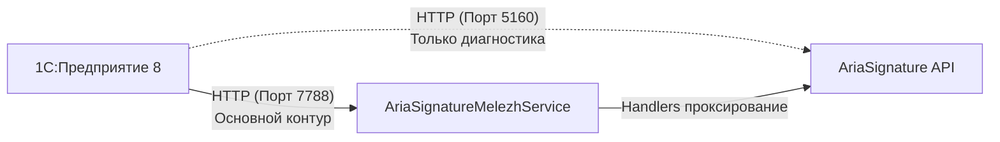
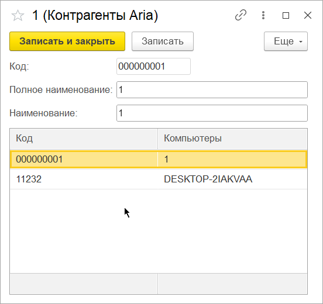
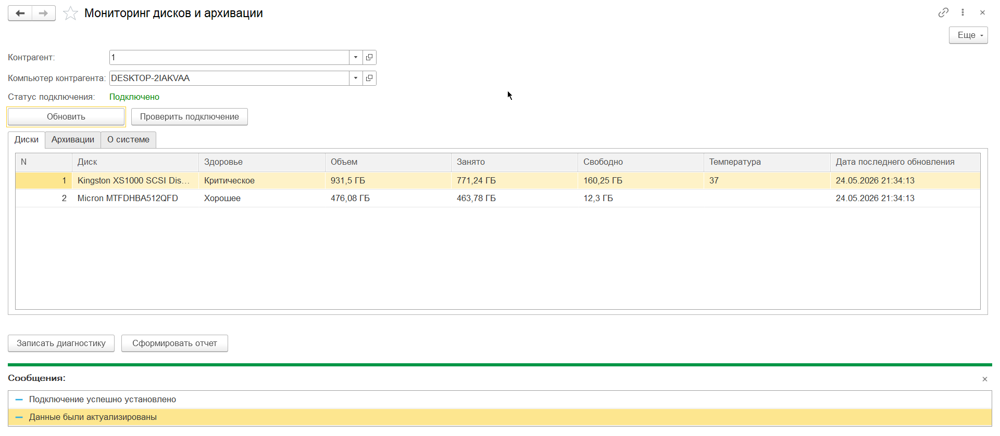
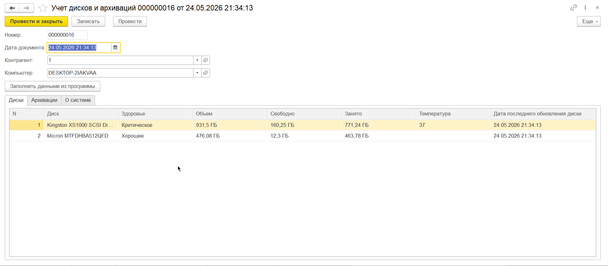

# Расширение 1С для мониторинга AriaSignature (AriaSignature-Cfe)

**AriaSignature-Cfe** — это профессиональное расширение для платформы 1С:Предприятие 8, обеспечивающее полноценный мониторинг состояния дисковых накопителей и задач архивации (резервного копирования) на компьютерах контрагентов. Расширение интегрируется с платформой **AriaSignature** через промежуточную прокси-службу **Melezh**.

> [!IMPORTANT]
> **Основной интеграционный контур**: 1С взаимодействует со службой Melezh по порту `:7788` через стандартизированный каталог handler keys. Прямые вызовы API AriaSignature (порт `:5160`) используются исключительно для операторской экспресс-диагностики.

---

## 1. Архитектура решения и контуры интеграции

Интеграция построена по трехуровневой схеме:

### Контракт службы Melezh (`:7788`):
* `GET /aria_ping` — проверка доступности прокси-шлюза;
* `GET /aria_get_disks` — получение текущих сведений о жестких и твердотельных дисках;
* `GET /aria_get_backups` — получение перечня настроенных задач резервного копирования;
* `GET /aria_get_backups_logs` — история запусков и логов выполнения резервного копирования;
* `POST /aria_sync` — принудительный запуск сценария синхронизации.

---

## 2. Модель метаданных расширения (Префикс `АС_`)

Все объекты расширения изолированы и используют уникальный префикс `АС_`:

* **Справочники**:
  * `АС_КонтрагентыAria` — перечень обслуживаемых клиентов.
  * `АС_КомпьютерыAria` — физические/виртуальные машины (точки мониторинга).
* **Документы**:
  * `АС_ДокументДискиИАрхивацияAria` — документ фиксации дискового пространства и состояния здоровья SMART, а также статусов резервного копирования.
* **Регистры сведений**:
  * `АС_РегистрДискиAria` — срез истории по накопителям
  * `АС_РегистрАрхивацииAria` — срез истории по резервному копированию
* **Обработки**:
  * `АС_МониторAria` — интерактивный пульт управления оператора.

---

## 3. Настройка и начало работы

1. Подключите расширение `AriaSignature-Cfe` к вашей информационной базе 1С.
2. Откройте справочник **Контрагенты Aria** (`АС_КонтрагентыAria`).
3. Добавьте контрагента и привяжите к нему компьютеры, указав их сетевые реквизиты (`HostName`, `IP-адрес`).

### Настройка контрагентов и привязка компьютеров:
На форме элемента справочника **Контрагенты Aria** отображается табличная часть со связанным оборудованием. Это позволяет видеть всю инфраструктуру клиента в едином окне:

---

## 4. Рабочее место оператора (Мониторинг)

Для интерактивного контроля за инфраструктурой используется обработка **Мониторинг дисков и архивации** (`АС_МониторAria`). 

### Возможности монитора:
* Выбор контрагента и быстрое переключение между его компьютерами.
* Отображение текущего сетевого статуса подключения (через `/aria_ping`).
* Вкладка **Диски** — визуализация состояния здоровья дисков (Хорошее, Критическое), температуры, объема и свободного места.
* Вкладка **Архивации** — сводный реестр задач бэкапа и логов их выполнения.
* Экспресс-кнопки проверки связи и ручной актуализации данных.

---

## 5. Регистрация данных и отказоустойчивость

Запись результатов мониторинга в базу данных 1С производится строго через проведение соответствующих документов. 

> [!TIP]
> **Принцип изоляции ошибок**: При пакетном опросе оборудования сбой или недоступность одного компьютера не останавливает опрос остальных устройств контрагента. Ошибки шлюза или таймауты логируются и записываются в служебные реквизиты документов.

При нажатии на кнопки «Записать диагностику» (или при автоматическом регламентном сборе) система формирует документ **Учет дисков и архиваций** (`АС_ДокументДискиИАрхивацияAria`). При проведении документ делает движения в периодические регистры сведений:

---

## 6. Разработчикам (Contributing)

Все стандарты написания кода, правила использования префиксов `АС_`, требования к интерактивному изменению форм в Конфигураторе и регламент работы с Хранилищем 1С описаны в файле [CONTRIBUTING.md](CONTRIBUTING.md). Пожалуйста, ознакомьтесь с ним перед отправкой изменений.

## 7. Лицензия

Проект распространяется под свободной лицензией **MIT**. Подробности в файле [LICENSE.md](LICENSE.md).
